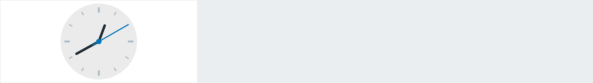
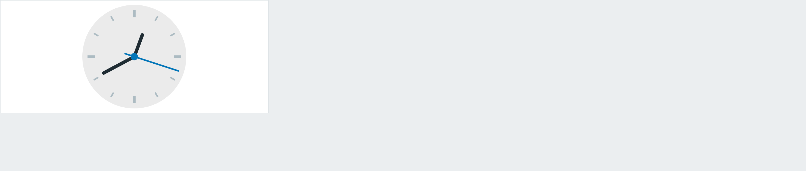

<h1>Hide widget header</h1>

developed and maintained by

and community

<strong>Takes the title bar off the widgets that do not need one - until you go to edit the board.</strong> 
A clock, a logo or a single big number reads better without a header above it; the header comes straight back the moment you switch the dashboard to edit mode, so nothing becomes unconfigurable.

<a href="#what-it-does"><strong>What it does</strong></a> &nbsp;·&nbsp;
<a href="#viewing-versus-editing"><strong>Viewing vs editing</strong></a> &nbsp;·&nbsp;
<a href="#install"><strong>Install</strong></a> &nbsp;·&nbsp;
<a href="#requirements"><strong>Requirements</strong></a> &nbsp;·&nbsp;
<a href="https://portal.initmax.com"><strong>Portal</strong></a> &nbsp;·&nbsp;
<a href="https://www.initmax.com/wiki/hide-widget-header/"><strong>Docs</strong></a>

 

---

## What it does

Zabbix already lets you mark a widget "hide header", but it still reserves the bar and shows it on hover - which is the right call while you are building a dashboard and noise once the board is on a wall.

**Hide widget header** takes those headers away completely while the dashboard is being VIEWED, and puts them back the moment you switch to edit mode - so every widget stays as configurable as it was. It applies only to widgets you have already marked as hidden-header; everything else looks exactly as before. There is nothing to configure: install it, enable it, done. The module ships a stylesheet and nothing else, so turning it off restores Zabbix exactly.

## Viewing versus editing

<table>
<tr>
<td width="50%" align="center" valign="top"> <small><b>Viewing the board</b> - no header, just the widget</small></td>
<td width="50%" align="center" valign="top"> <small><b>Editing the board</b> - the header is back, so the widget stays configurable</small></td>
</tr>
</table>

## Install

The module ships as a **GPG-signed `deb` / `rpm` package** from the initMAX repository - `apt` / `dnf` installs it and keeps it updated.

### Easiest way - the guided installer on the Portal

Open the product page, pick your **OS**, and copy the ready-made command. It is fully public, no login needed. There's a feedback box right there too.

<a href="https://portal.initmax.com/catalog/zabbix-hidewidgetheader#how-to-install"><strong>→ Open the installer on the Portal</strong></a>

Prefer a plain archive? Every release also ships as a **ZIP** [straight from the repo](https://repo.initmax.com/zabbix/free/zip/hidewidgetheader/) - handy for offline or manual installs.

Then enable it in **Administration → General → Modules**, and set any widget's header to hidden in its own settings. Done.

## Requirements

|              |                                                              |
| ------------ | ------------------------------------------------------------ |
| **Zabbix**   | 6.0 · 6.2 · 6.4 · 7.0 · 7.2 · 7.4 - one package covers all    |
| **PHP**      | 7.4 or newer                                                 |
| **OS**       | Debian/Ubuntu · RHEL/Rocky/Alma/Oracle/Amazon · SUSE         |
| **Edition**  | FREE - there is no paid edition of this module               |
| **Languages** | Every language Zabbix supports. The module renders no text of its own - it is a stylesheet - so nothing in your interface changes language |
| **High availability** | Ready. A stylesheet only - no server-side component and no local state; install it on every frontend node of an HA cluster and any node can serve it |

One package covers the whole range. Zabbix renamed the widget header element in 7.0 and changed its module API at 6.4, and the package carries what each frontend needs, so the same install works on 6.0 and on 7.4.

## Support &amp; links

- 📚 **[Documentation / Wiki](https://www.initmax.com/wiki/hide-widget-header/)**
- 🛒 **[Product page](https://www.initmax.com/product/hide-widget-header/)**
- 🎫 **[Portal](https://portal.initmax.com)** - downloads, support tickets
- 💾 **Source code** (AGPLv3) - included in every package and published as a [source archive](https://repo.initmax.com/zabbix/free/zip/hidewidgetheader/) on repo.initmax.com
- ✉️ **[support@initmax.com](mailto:support@initmax.com)**

---

<a href="https://www.gnu.org/licenses/agpl-3.0.html">AGPLv3</a> &nbsp;·&nbsp; © 2021–2026 initMAX s.r.o.

