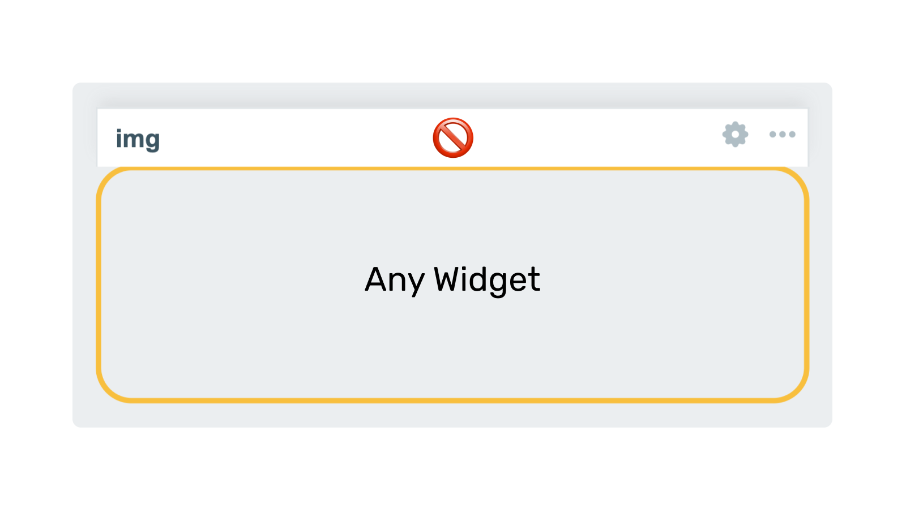

    
    <h3>
        
            Honesty, diligence and MAXimum knowledge of our products is our standard.
        
    </h3>
    <h3>
        &nbsp;&nbsp;&nbsp;
        &nbsp;&nbsp;&nbsp;
        &nbsp;&nbsp;&nbsp;
        &nbsp;&nbsp;&nbsp;
        &nbsp;&nbsp;&nbsp;
        
    </h3>

 

---
---

 
 

    <h1>
        Hide widget header
    </h1>
    <h4><i>
        This module enables headers to appear on widgets when hovering the mouse, but only in dashboard edit mode.
    </i></h4>
      
    
    
      
    

 
 

<!-- *********************************************************************************************************************************** -->
<!-- *** BODY ************************************************************************************************************************** -->
<!-- *********************************************************************************************************************************** -->
## Description
The Hide widget header module is designed to improve the visual clarity and usability of the Zabbix dashboard by preventing widget headers from appearing in normal dashboard view. The headers remain hidden until edit mode is activated, ensuring a clean, minimalist, and distraction-free interface during regular use.

This feature is particularly useful for users who prefer an uncluttered workspace, allowing them to focus on the most important data without unnecessary visual elements taking up space. By keeping headers concealed, it improves the overall aesthetics and readability of the dashboard, making it more streamlined and professional.

The module requires no additional configuration, as it is automatically activated when enabled in Zabbix. This makes it a hassle-free solution for users who want an improved dashboard experience without having to adjust complex settings.

  

    <a href="https://www.initmax.com/wiki/hide-widget-header/">
         
        <b>Documentation</b> 
        
    </a>

 
 

---
---

 

    <a href="https://www.initmax.com/">
         initMAX.com
    </a>&nbsp;&nbsp;&nbsp;
    <a href="tel:+420800244442">
         +420800244442
    </a>&nbsp;&nbsp;&nbsp;
    <a href="mailto:info@initmax.com">
         info@initmax.com
    </a>
       
    &nbsp;
    &nbsp;
    &nbsp;
    &nbsp;
    &nbsp;
       
    &nbsp;&nbsp;&nbsp;
    
       
    

